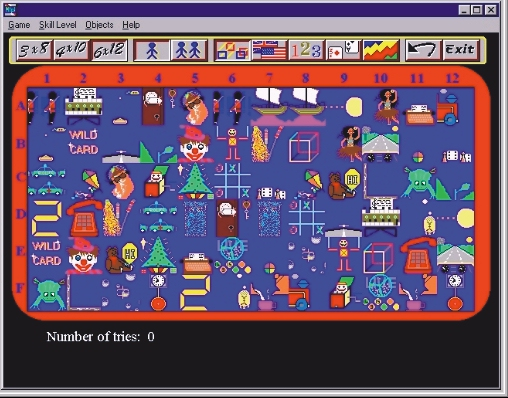

## Flip\!  A Complete Game for Windows\.

### Description

This is the complete game in code. An addictive colorful, musical Guess-the-word mix'n match puzzle game for up to 2 players, And It's all Visual Basic.

In code it demonstrates:

Animation/graphics,

How to make your own custom toolbar,

Music (MCI32),

Game timing control,

Keeping a Score table,

Mouse control,

A method of employing Shareware.

Programmed in VB4 32bit,

it will compile in VB6. Flip! It was sold as a commercial Game for Windows in the United States and Europe during 1996 and went on to sell over 17500 copies worldwide. I have released it to the Programmers domain so other can learn Windows game programming from it. So you youre not a porgrammer, you can still enjoy the game!
 
### More Info
 

             |
---                |---
**Submitted On**   |2000-11-07 17:33:52
**By**             |[Jason Bennison](https://github.com/Planet-Source-Code/PSCIndex/blob/master/ByAuthor/jason-bennison.md)
**Level**          |Advanced
**User Rating**    |4.8 (111 globes from 23 users)
**Compatibility**  |VB 4\.0 \(32\-bit\), VB 5\.0, VB 6\.0
**Category**       |[Games](https://github.com/Planet-Source-Code/PSCIndex/blob/master/ByCategory/games__1-38.md)
**World**          |[Visual Basic](https://github.com/Planet-Source-Code/PSCIndex/blob/master/ByWorld/visual-basic.md)
**Archive File**   |[CODE\_UPLOAD114381172000\.zip](https://github.com/Planet-Source-Code/jason-bennison-flip-a-complete-game-for-windows__1-12612/archive/master.zip)

